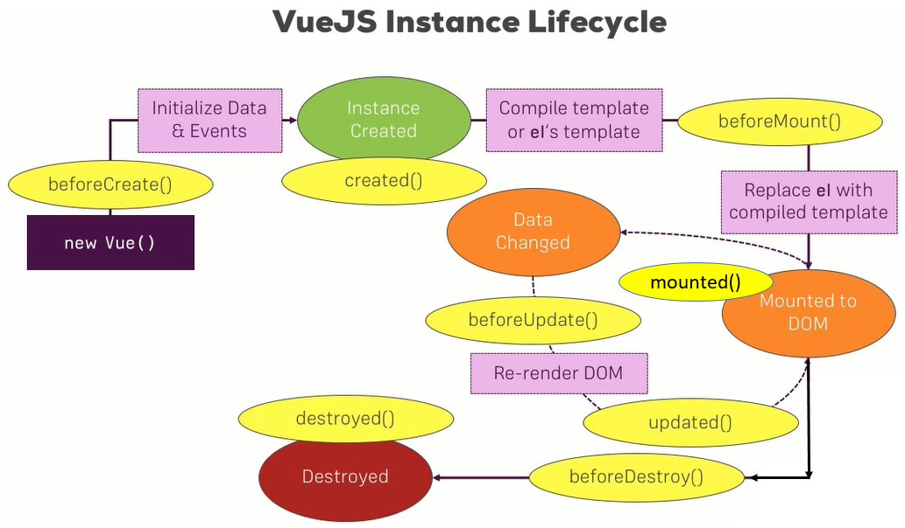

## 02 DOM interaction

JSFiddle Links:
* Getting Started:https://jsfiddle.net/smax/pcjtcmdm/
* Template Syntax:https://jsfiddle.net/smax/bkk97b7g/
* Events:https://jsfiddle.net/smax/7zdak05g/
* Two-Way-Binding:https://jsfiddle.net/smax/ut0tsbcu/
* Computed Properties &Watch:https://jsfiddle.net/smax/yLjqxmw0/
* Dynamic Classes:https://jsfiddle.net/smax/gowg40ym/
* Dynamic Styles:https://jsfiddle.net/smax/3rvdLq5y/

Further Links:
* Official Docs - Getting Started:http://vuejs.org/guide/
* Official Docs - Template Syntax:http://vuejs.org/guide/syntax.html
* Official Docs - Events:http://vuejs.org/guide/events.html
* Official Docs - Computed Properties &Watchers:http://vuejs.org/guide/computed.html
* Official Docs - Class and Style Binding:http://vuejs.org/guide/class-and-style.html

## 03 Conditionals and lists
JSFiddle:
* Conditionals (v-if and v-show):https://jsfiddle.net/smax/hoc719j5/
* Lists:https://jsfiddle.net/smax/o7uy2g0u/

Useful Links:
* Official Docs - Conditionals:http://vuejs.org/guide/conditional.html
* Official Docs - Lists:http://vuejs.org/guide/list.html

## 05 Understaning VueJS instance

Useful Links:
* Official Docs - The Vue Instance:http://vuejs.org/guide/instance.html
* Official Docs - VueJS API: http://vuejs.org/api/

## VueJS lifecycle

## 07 Introduction to components

Useful Links:
* Official Docs - Components:http://vuejs.org/guide/components.html

## 08 Communicating components

Useful Links:
* Official Docs - Props:http://vuejs.org/guide/components.html#Props
* Official Docs - Custom Events:http://vuejs.org/guide/components.html#Custom-Events
* Official Docs - Non-Parent-Child Communication:http://vuejs.org/guide/components.html#Non-Parent-Child-Communication

## 09 Advanced component features

Helpful Links:
* Official Docs -Slots:http://vuejs.org/guide/components.html#Content-Distribution-with-Slots
* Official Docs -Dynamic Components:http://vuejs.org/guide/components.html#Dynamic-Components
* Official Docs - Misc:http://vuejs.org/guide/components.html#Misc

## 10 Form control

Useful Links:
* Official Docs - Forms:http://vuejs.org/guide/forms.html